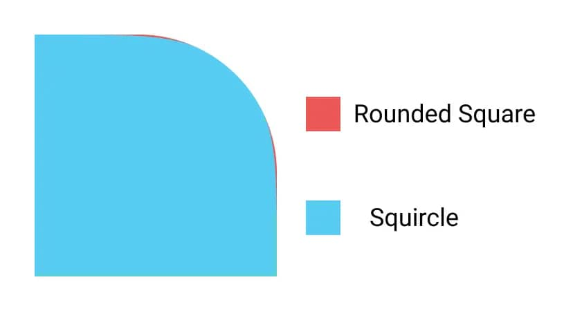

# Figma Squircle Rust

> Figma-flavored squircles for everyone

## Disclaimer

> This library is not an official product from the Figma team and does not guarantee to produce the same results as you would get in Figma.

> This is a rust fork of [phamfoo/figma-squircle](https://github.com/phamfoo/figma-squircle) - Big thanks to the original creator.

## What is this?

Figma has a great feature called [corner smoothing](https://help.figma.com/hc/en-us/articles/360050986854-Adjust-corner-radius-and-smoothing), allowing you to create rounded shapes with a seamless continuous curve (squircles).



This library helps you bring those squircles to your apps.

## Installation

```sh
figma_squircle = "0.1.0"
```

## Usage

```rs
use figma_squircle::{get_svg_path, FigmaSquircleParams};

fn main() {
    let svg_path = get_svg_path(
        FigmaSquircleParams::default()
            .width(200.)
            .height(200.)
            .corner_radius(24.) // Defaults to 0.
            .corner_smoothing(0.8) // `corner_smoothing` goes from 0 to 1.
    );

    let svg_path = get_svg_path(
        FigmaSquircleParams::default()
            .width(200.)
            .height(200.)
            .corner_radius(24.)
            .corner_smoothing(0.8) // Defaults to 1.
            // You can also adjust the radius of each corner individually.
            .top_left_corner_radius(48.)
    );

    let svg_path = get_svg_path(
        FigmaSquircleParams::default()
            // You can also set both the width and height at once.
            .size(200.)
    );
}
```

## Preserve Smoothing

The larger the corner radius, the less space we have left to make a smooth transition from the straight line to the rounded corner. As a result, you might have noticed that the smoothing effect appears to be less pronounced as the radius gets bigger.

Try enabling `preserve_smoothing` if you're not happy with the generated shape. 

```rs
let svg_path = get_svg_path(
    FigmaSquircleParams::default()
        .width(200.)
        .height(200.)
        .corner_radius(24.)
        .corner_smoothing(0.8)
        .preserve_smoothing(true) // Defaults to false.
);
```

There's also a [Figma plugin](https://www.figma.com/community/plugin/1122437229616103296) that utilizes this option.

## Thanks

- Figma team for publishing [this article](https://www.figma.com/blog/desperately-seeking-squircles/) and [MartinRGB](https://github.com/MartinRGB) for [figuring out all the math](https://github.com/MartinRGB/Figma_Squircles_Approximation) behind it.
- [phamfoo](https://github.com/phamfoo) for creating [figma-squircle](https://github.com/phamfoo/figma-squircle), which this project was forked from.